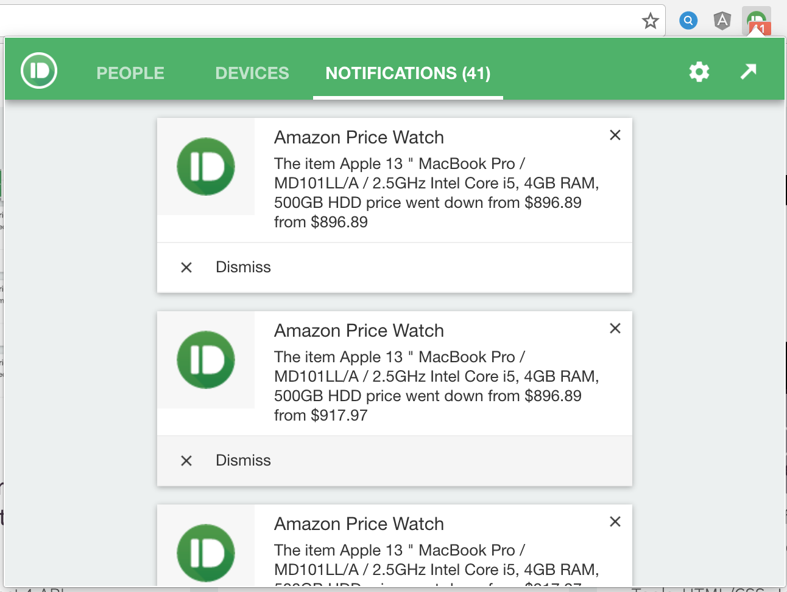

*************************************************

### AMAZON PRODUCT AND PRICE TRACKER

#### Made By: Victoria Fajardo
************************************************
**Technologies Used:**
- Express
- NODE JS
- CLI
- PushBullet API
- Chrome Extension
- Github
- Preferred web browser will be Chrome and Safari.

**CONCEPT/PURPOSE:**
My core project in my portfolio is the Amazon Price Tracker application. Users set price notifications for Amazon products and the application notifies the user of price changes via desktop notice, text or email that includes a link to the product. For users who like to price shop and often hold off on purchases in hopes of price decreases, this prevents them from having to perform ongoing price checks and lets them know when is the right time to purchase. This is an API back end project and requires installation.

**FEATURES:**
Amazon product price tracking and desktop notifications through Chrome Extension.

**INSTALLATION INSTRUCTIONS**
This is a back end project and requires installation, database creation with password, API token, and server to fully operate for viewing.  Otherwise, please view the project code in my Github.
